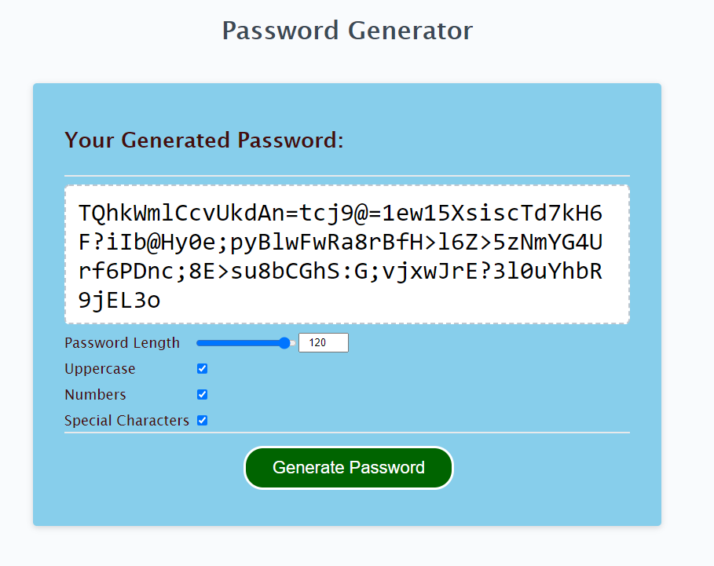

# Week 3 Homework: Password Generator

My solution, hosted using Github Pages:
https://raven-bootcamp.github.io/week3-homework-pword-gen/

The repository for my code: 
https://github.com/raven-bootcamp/week3-homework-pword-gen

## The Task
Using some pre-existing code, we are to create an application (which runs in the browser) that enables a user to generate random passwords based on criteria that they’ve selected.

We have been given some HTML and CSS code and we need to use Javascript to build the rest.

It us up to us to ensure we meet the following Acceptance Criteria.

## Explanation
When doing this homework, I felt that the proposed solution was very clunky and not well designed.  This might be a deliberate choice from when the task was originally designed, but I strongly felt that a series of browser input boxes was not a very user-friendly way of gathering the choices from the user.

As a result, I added elements to the page of the original design to now include a linked slider and input box to select your password's length, and some checkboxes to select your choice for uppercase, numeric and special characters.

Thus, my solution (see screenshot below) may not meet the Acceptance Criteria as literally written, but overall it is a more intuitive and friendly solution for the user.

## Acceptance Criteria

```
GIVEN I need a new, secure password
WHEN I click the button to generate a password
THEN I am presented with a series of prompts for password criteria
WHEN prompted for password criteria
THEN I select which criteria to include in the password
WHEN prompted for the length of the password
THEN I choose a length of at least 8 characters and no more than 128 characters
WHEN prompted for character types to include in the password
THEN I choose lowercase, uppercase, numeric, and/or special characters
WHEN I answer each prompt
THEN my input should be validated and at least one character type should be selected
WHEN all prompts are answered
THEN a password is generated that matches the selected criteria
WHEN the password is generated
THEN the password is either displayed in an alert or written to the page
```
## Mockup
We have been given the following mockup to use as we build it:


## Solution Screenshot


